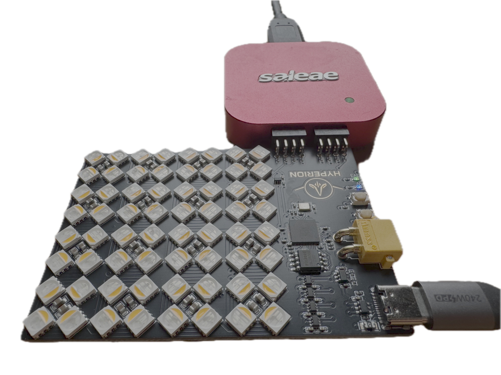
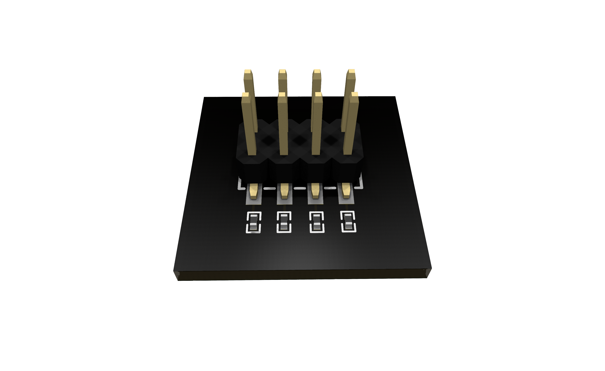

# Debug Header for Saleae Logic Analyzers

Features:
- **SaleaeHeaderVertical**: Single vertical header for connection via harness
- **SaleaeHeaderRightAngle_x**: Right-angle headers for direct connection to Saleae(x=1,2,4)
- **Built-in protection**: 1kΩ series resistors on all signal lines
- **Bus monitoring**: Easy connection to I2C, SPI, and other digital signals 

## SaleaeHeaderRightAngle_2


## SaleaeHeaderVertical


## Usage

```ato
from "atopile/saleae-header/saleae-header.ato" import SaleaeHeaderVertical
from "atopile/saleae-header/saleae-header.ato" import SaleaeHeaderRightAngle_2
import ElectricSignal,SPI,I2C

module Usage:
    # Example signals of interest
    spi = new SPI
    spi_cs = new ElectricSignal
    i2c = new I2C

    # Single vertical header for connection with Saleae through harness
    harness_saleae_debug_header = new SaleaeHeaderVertical

    spi.mosi ~ harness_saleae_debug_header.channels[0]
    spi.miso ~ harness_saleae_debug_header.channels[1]
    spi.sclk ~ harness_saleae_debug_header.channels[2]
    spi_cs ~ harness_saleae_debug_header.channels[3]

    # Double right angle female header for direct connection to Saleae Logic 8/16
    direct_saleae_interface = new SaleaeHeaderRightAngle_2

    spi ~ direct_saleae_interface.headers[0].spi
    spi_cs ~ direct_saleae_interface.headers[0].spi_cs

    i2c ~ direct_saleae_interface.headers[1].i2c

```

## Contributing

Contributions to this package are welcome via pull requests on the GitHub repository.

## License

This atopile package is provided under the [MIT License](https://opensource.org/license/mit/).
